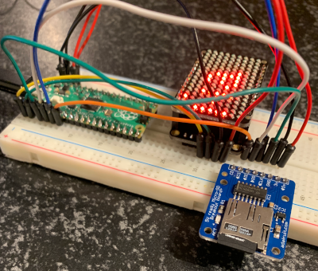
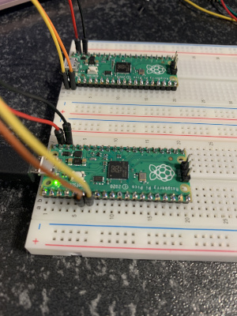

# Hardware

* Raspberry PI Pico

## Pins and protocols
* https://learn.adafruit.com/getting-started-with-raspberry-pi-pico-circuitpython?view=all
* https://datasheets.raspberrypi.com/pico/Pico-R3-A4-Pinout.pdf
* https://learn.adafruit.com/circuitpython-essentials/circuitpython-uart-serial

## Cool hardware
* https://learn.adafruit.com/i31fl3731-16x9-charliplexed-pwm-led-driver/overview
* https://learn.adafruit.com/adafruit-micro-sd-breakout-board-card-tutorial/introduction


# Software

## Thonny

Install:
```
brew install thonny
```

Start:
```
open -a thonny
```

More:
* https://thonny.org/


## CircuitPython

### Download:
* https://circuitpython.org/

### Docs:
* https://circuitpython.readthedocs.io/en/latest/README.html

## Rust
* https://github.com/rp-rs/rp2040-project-template/tree/main/src
* https://reltech.substack.com/p/getting-started-with-rust-on-a-raspberry


## probe
* https://github.com/raspberrypi/picoprobe
* https://github.com/majbthrd/DapperMime/

## pico-sdk
https://blog.smittytone.net/2021/02/02/program-raspberry-pi-pico-c-mac/

# RPIPICO-experiments

## Micro SD and leds
Connect a micro-sd card with text files, and display the text on the led display.



## Serial port debug probe

Install picoprobe on 1 pico and circuitpython on the other, and use the serial port to communicate.



